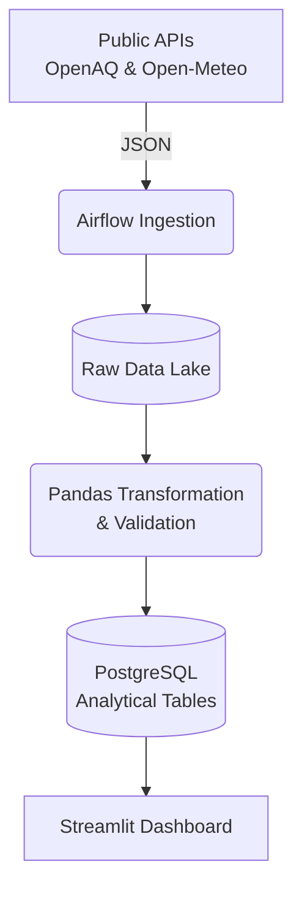

# Project Title

Air Quality Index Analysis and Prediction

## 1. Project Overview

This project implements the foundational Data Engineering and Analytical layers (Part 1) of a comprehensive Air Quality Index pipeline. The objective is to automatically ingest, validate, transform, and store air pollution and weather data from multiple cities in India, enabling localized historical and comparative analysis through an interactive analytical dashboard. 

*(Note: Machine Learning, AQI Prediction, and MLOps deployments are intentionally scoped for Part 2 and are not included in this phase).*

## 2. Architecture

The data pipeline follows a classic ETL (Extract, Transform, Load) architecture orchestrated by Apache Airflow:
1. **Source**: Pulls from public REST APIs.
2. **Ingestion**: Extracts raw JSON payloads to local storage (`data/raw/`).
3. **Transformation**: Parses timestamps to UTC, resolves duplicates, normalizes units, joins weather enrichment context, and computes the Indian National Air Quality Index (NAQI).
4. **Storage**: Idempotent upserts into a relational PostgreSQL database.
5. **Presentation**: A Streamlit web dashboard querying the analytical PostgreSQL tables.



*See [`docs/architecture_diagram.mermaid`](docs/architecture_diagram.mermaid) for a more detailed, layer-by-layer visual pipeline flow.*

## 3. Data Sources

1. **OpenAQ (Air Pollution)**: Provides hourly PM2.5 and NO2 concentrations from specific Indian monitoring stations via API v3. 
2. **Open-Meteo (Weather)**: Provides contextual meteorological data (Temperature, Humidity, Precipitation, Wind Speed) for the coordinates of the ingested stations via API v1.

## 4. Project Structure

```
AQI-Prediction-Project/
│
├── config/              # Configuration files (stations.json)
├── dags/                # Airflow orchestration DAGs
├── dashboard/           # Streamlit application (app.py)
├── data/                # Local data storage (raw, staging, cleaned, rejected)
├── docs/                # Project documentation, evidence, and reports
├── logs/                # Execution and error logs
├── sql/                 # SQL analysis queries
├── src/                 # Python source code for ingestion, transformation, and DB
│   ├── database/        # SQLAlchemy models and loader scripts
│   ├── ingestion/       # Collectors for OpenAQ and Open-Meteo
│   └── transformation/  # Aggregator, NAQI calculation, and validation logic
│
├── .env.example         # Environment variable template
├── README.md            # This file
└── requirements.txt     # Python dependencies
```

## 5. Environment Setup

It is highly recommended to use a Python Virtual Environment (Python 3.14).

```bash
# Create a virtual environment
python -m venv .venv

# Activate the virtual environment (Windows)
.\.venv\Scripts\activate

# Activate the virtual environment (macOS/Linux)
source .venv/bin/activate
```

## 6. Environment Variables

Create a file named `.env` in the root directory by copying the provided template:

```bash
cp .env.example .env
```

Populate the `.env` file with your specific credentials:
```env
# API Configuration
OPENAQ_API_KEY=your_openaq_v3_api_key_here
OPEN_METEO_API_URL=https://archive-api.open-meteo.com/v1/archive

# Database Connection (PostgreSQL)
DB_HOST=localhost
DB_PORT=5432
DB_NAME=aqi_db
DB_USER=your_postgres_user
DB_PASSWORD=your_postgres_password
```
**CRITICAL**: NEVER commit the `.env` file or expose your actual passwords/API keys in any code or logs.

## 7. Install Dependencies

Install the required Python packages for the data pipeline and dashboard:

```bash
pip install -r requirements.txt
```

## 8. Run Ingestion

The ingestion modules can be run individually to fetch data and drop it into the `data/raw/` directory:

```bash
# Ingest Pollution Data
python src/ingestion/openaq_ingest.py

# Ingest Weather Data
python src/ingestion/openmeteo_ingest.py
```

## 9. Run Airflow

The entire pipeline is orchestrated via Apache Airflow. In this project (due to Windows compatibility), Airflow runs in an isolated Python 3.10 environment (`.airflow_venv`) and triggers the project scripts.

To run the end-to-end Airflow DAG locally:

```powershell
$env:AIRFLOW_HOME="$PWD\airflow_home"
.\.airflow_venv\Scripts\airflow.exe dags test aqi_data_pipeline $(Get-Date -Format "yyyy-MM-dd") --subdir dags
```

## 10. Run Dashboard

Once the database is populated, launch the interactive Streamlit dashboard:

```bash
.\.venv\Scripts\streamlit.exe run dashboard/app.py
```
*(If you are on macOS/Linux, simply use `streamlit run dashboard/app.py` after activating your virtual environment).*

## 11. Database

The project utilizes **PostgreSQL 18.6** as the analytical data warehouse.
- **`stations`**: Active monitoring stations and metadata.
- **`hourly_air_quality`**: Granular fact table of hourly pollution observations and weather.
- **`daily_aqi`**: Station-level daily aggregated metrics and calculated NAQI.
- **`daily_city_aqi`**: Pre-aggregated city-level metrics (ensuring proper spatial aggregation before AQI calculation).

## 12. Data Quality

Validation rules are strictly enforced prior to database loading:
- **Missing Periods**: Automatically logged without fabricating missing data.
- **Anomalies**: Negative pollution values are rejected and quarantined into `data/rejected/rejected_records.csv`.
- **Uniqueness**: Hourly duplicate readings are resolved via mean aggregation; database physical `UNIQUE` constraints prevent duplicated insertions during DAG reruns.
- **Timestamps**: Normalized to UTC and floored to the nearest hour.

## 13. Dashboard Features

The Streamlit dashboard allows for deep analysis using the following features:
- **AQI Trend**: Daily time-series line chart.
- **City Comparison**: Average AQI compared across all tracked cities.
- **Station Comparison**: Granular AQI comparison within a specific city.
- **PM2.5 vs NO2**: Scatter plot assessing the relationship between main pollutants.
- **AQI Category Distribution**: Breakdown of days spent in Good, Moderate, Poor, etc.
- **Weather vs AQI**: Assessing temperature's impact on air quality.
- **Hourly Pollution Pattern**: Analyzing intra-day PM2.5 fluctuations.
- **Station Coverage**: Data availability and observation counts per station.

## 14. Part 1 Status

**COMPLETE.** Part 1 successfully implements the core Data Engineering, ETL orchestration, robust relational storage, and the Analytical Dashboard presentation layer. It serves as a fully functional data infrastructure.

*(Note: Part 2 ML/MLOps is explicitly NOT implemented in this phase).*

## 15. Future Work

**Part 2** will extend this completed pipeline with advanced capabilities:
- Next-day AQI prediction and classification using Machine Learning.
- Feature engineering derived from the Phase 1 analytical tables.
- MLflow for experiment tracking and model registry.
- FastAPI for real-time model serving.
- Docker containerization for deployment and scalable MLOps workflows.
